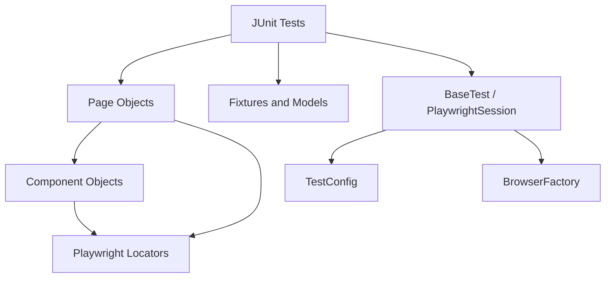

# Playwright Java Test Automation Framework

[](https://github.com/ftrabucco/playwright-java-automation-template/actions/workflows/e2e.yml)


Reusable E2E automation framework built with Java, Playwright and JUnit 5. SauceDemo is used as the sample application, but the framework is structured as a template that can be adapted to other web products.

## Highlights

- Page Object Model with reusable component objects.
- Isolated Playwright browser context per test.
- Externalized configuration with Maven system property overrides.
- Cross-browser execution through `chromium`, `firefox` or `webkit`.
- Tag-based execution for smoke/regression slicing.
- Allure-ready reporting with screenshots and Playwright traces on failures.
- CI workflow with Maven cache, browser matrix and artifact upload.
- Documentation for architecture, reporting, test strategy and test authoring.

## Tech Stack

- Java 17+
- Maven
- Playwright Java
- JUnit 5
- AssertJ
- Allure Report
- GitHub Actions

## Project Structure

```text
src/test/java/com/fran/saucedemo
├── components   # Reusable UI fragments, such as header/cart
├── config       # Runtime configuration and browser selection
├── core         # Playwright lifecycle, BrowserFactory and BaseTest
├── fixtures     # Versioned test data
├── models       # Typed test/domain data
├── pages        # Page Objects
├── tests        # Behavior-oriented test classes
└── utils        # Small framework utilities
```

## Architecture



More detail: [docs/architecture.md](docs/architecture.md)

## Covered Scenarios

- Login success and authentication errors.
- Locked-out user validation.
- Product sorting by name and price.
- Add/remove products from inventory and cart.
- Checkout happy path.
- Checkout required-field validation.
- Checkout summary totals.

## Getting Started

Install Playwright browsers:

```bash
mvn exec:java -Dexec.mainClass=com.microsoft.playwright.CLI -Dexec.args="install"
```

Run the full suite:

```bash
mvn test
```

Run smoke tests:

```bash
mvn test -Dgroups=smoke
```

Check formatting:

```bash
mvn spotless:check
```

Run a feature slice:

```bash
mvn test -Dgroups=checkout
```

Run headed with slow motion:

```bash
mvn test -Dheadless=false -Dslow.motion.ms=150
```

Run with a fixed number of parallel workers:

```bash
mvn test -Djunit.jupiter.execution.parallel.config.strategy=fixed -Djunit.jupiter.execution.parallel.config.fixed.parallelism=2
```

Run one selected test with the browser visible:

```bash
mvn test -Dtest=LoginTest#standardUserCanLogIn -Dheadless=false -Dslow.motion.ms=250 -Djunit.jupiter.execution.parallel.enabled=false
```

Run with another browser:

```bash
mvn test -Dbrowser=firefox
```

Parallel execution is documented in [docs/parallel-execution.md](docs/parallel-execution.md).

Generate an Allure report:

```bash
mvn allure:report
```

Open it locally:

```bash
python3 -m http.server 8080 --directory target/site/allure-maven-plugin
```

Then browse to `http://localhost:8080`.

Reporting trade-offs are documented in [docs/reporting.md](docs/reporting.md).

## Configuration

Default values live in `src/test/resources/config.properties`.

```properties
base.url=https://www.saucedemo.com
browser=chromium
headless=true
timeout.ms=10000
trace.enabled=true
trace.attach.on.failure.only=true
screenshot.on.failure=true
screenshot.always=false
```

Any value can be overridden with Maven:

```bash
mvn test -Dbrowser=webkit -Dheadless=false
```

Attach a screenshot for every test:

```bash
mvn test -Dscreenshot.always=true
```

Attach Playwright traces for every test instead of failures only:

```bash
mvn test -Dtrace.attach.on.failure.only=false
```

## Logging

Console logging is intentionally concise by default. The framework prints one readable start/end
line per test and keeps lower-level browser/session/artifact details at `debug` level because
parallel test execution can interleave messages and make verbose output hard to read.

Run with debug logs when investigating framework internals locally:

```bash
mvn test -Dorg.slf4j.simpleLogger.defaultLogLevel=debug
```

For regular debugging, prefer Allure attachments, screenshots and Playwright traces as the main
evidence.

## How To Add A New Test

1. Identify the user behavior to automate.
2. Add or extend a Page Object method with a business-readable name.
3. Keep selectors inside pages/components, not inside test classes.
4. Put reusable data in `fixtures` and typed data in `models`.
5. Add JUnit tags that describe execution intent, for example `smoke`, `login`, `checkout`.
6. Run the focused tag first, then the full suite.

More detail: [docs/how-to-add-tests.md](docs/how-to-add-tests.md)

## CI

The GitHub Actions workflow runs the suite in CI and uploads Allure/Playwright artifacts:

[.github/workflows/e2e.yml](.github/workflows/e2e.yml)

To publish the latest Allure report to GitHub Pages, run the workflow manually and set:

```text
publish_report = true
```

Before the first publication, enable GitHub Pages in the repository settings:

```text
Settings -> Pages -> Build and deployment -> Source: GitHub Actions
```

## Template Usage

To reuse this as a template for another app:

1. Replace the package/app-specific names under `com.fran.saucedemo`.
2. Change `base.url` in `config.properties`.
3. Keep `core`, `config`, `utils` and the overall test architecture.
4. Replace `pages`, `components`, `fixtures` and `tests` with the target product model.

## Portfolio Notes

This project is intended to demonstrate SDET/QA Automation framework design, not only UI scripting. It highlights:

- maintainable Page Object and Component Object modeling
- isolated browser sessions for parallel execution
- configurable browser, trace, screenshot and report behavior
- Allure reporting with debugging evidence
- GitHub Actions CI with cross-browser matrix execution
- quality gates with Maven Enforcer and Spotless
- documentation of architectural and reporting trade-offs

## Test Strategy

See [docs/test-strategy.md](docs/test-strategy.md).

## License

This project is available under the MIT License.
